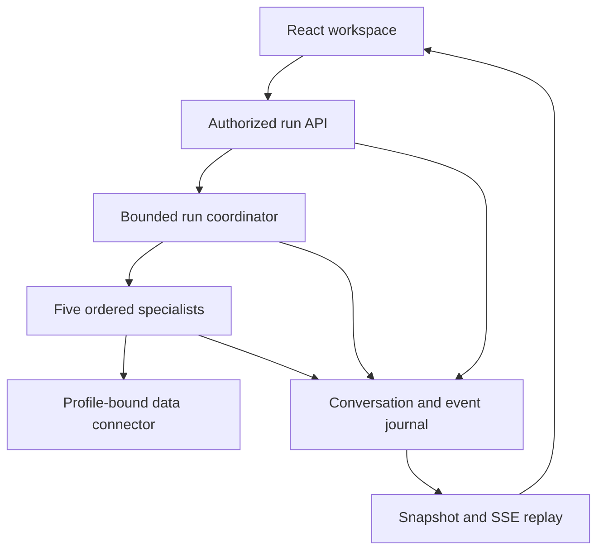
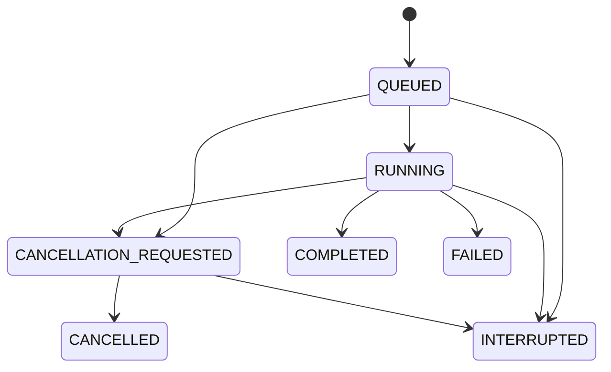

# Cycle 5: durable conversations and resumable runs

Updated: 2026-09-08. This milestone implements persisted conversation/run records, ordered
progress events, safe retries, cancellation, restart recovery, and the React CSV conversation
experience. It builds on Cycle 4's bounded specialists. The user's request to proceed authorizes
this development while **LA-1 remains open**; it does not waive or pass real Claude acceptance.
GCP/SSO activation remains separately deferred under DG-1. Cycle 6.1 now adds the operational
recovery and release evidence controls described in [RELEASE_OPERATIONS.md](RELEASE_OPERATIONS.md).

## Delivered behavior and operating boundary

A question becomes a server-owned run. Closing its HTTP connection or refreshing the UI does
not cancel execution. The client can reconnect, recover the current snapshot and replay progress.
Retrying a lost submission acknowledgment with the same request ID returns the original run.
It cannot silently change the question, source, date anchor or definition version.

With durable storage configured, completed answers, receipts, conversation revisions and events
survive an API restart. CSV workspaces also retain the uploaded source, approved definitions and
the latest four reproducible query inputs. The original session expiry still applies; restarting
does not extend the capability's lifetime. An unfinished run becomes `INTERRUPTED` after restart.
It is never automatically executed again when a remote query's completion may be unknown.

**The implemented execution profile is one API worker per local SQLite database.** The packaged
CSV demo mounts a persistent volume. Internal state uses its own explicitly configured private
file and signed identity. No CSV state, data, credentials or requests enter BigQuery. This is a
tested reference storage implementation, not a horizontally scalable production job platform.
Cloud SQL/PostgreSQL application state, distributed workers, managed queues, HA, backup and
retention operations are outstanding enterprise release work. The existing PostgreSQL *data
connector* is separate from the application-state store.

Saved conversation history is not unbounded model memory. Each question must be self-contained.
No prior conversation transcript, saved query rows or result body is appended to Claude's prompt.
The current React workspace is the optional CSV demonstration; the internal protocol is available
to an authenticated product UI, whose SSO integration remains part of private release acceptance.

## Architecture and module responsibilities



| Module | Responsibility |
| --- | --- |
| `domain/runs.py` | Strict requests, conversation/run/event schemas, status machine, identity/scope hashes |
| `services/run_store.py` | SQLite transactions, revisions, idempotency, ordered events, recovery, retention bounds and exclusive worker lock |
| `services/run_coordinator.py` | Bounded asynchronous execution, cancellation, terminal release and shutdown cleanup |
| `api/run_routes.py` | Shared conversation/run HTTP contracts, authorized snapshots and SSE replay |
| `api/routes/csv_runs.py` | Resolve the anonymous CSV capability and its isolated workspace |
| `internal/runs.py` | Derive signed internal identity, recheck grants and bind the private connection |
| `services/csv_checkpoint.py` | Versioned CSV checkpoint schema, retained source and saved interpretation contracts |
| `services/csv_workspace.py` | CSV source leases, capability expiry, workspace persistence and historical query reproduction |
| `services/agent_runtime.py` | Emit copies of stage/usage reports to the journal at bounded specialist transitions |
| `apps/web/src/lib/runs.ts` | Typed run client, streaming parser, cursor validation and snapshot recovery |
| `apps/web/src/hooks/useWorkspace.ts` | Persist pending submissions, recover runs and coordinate UI state |
| `apps/web/src/components/ConversationPanel.tsx` | Display progress, cancellation, interrupted work and saved answers |

The implementation uses Python 3.11+, FastAPI, asyncio, SQLite and Pydantic on the backend,
and React/TypeScript with the browser Fetch/Streams APIs on the frontend. No additional agent
framework owns authorization or connector selection. `main.py`, `main.tsx` and `App.tsx` keep
their composition responsibilities. CopilotKit can later consume this protocol as an optional
UI adapter; it is not required for the delivered behavior.

## Admission, identity and idempotency

1. The profile resolves authority before admission. CSV accepts exactly one bounded
   `X-Demo-Session` capability. Internal middleware verifies the signed identity and loads
   server-owned tenant, role, classification, metric and dimension grants.
2. A conversation is bound to a hash of profile/tenant/user plus a hash of the complete access
   scope. Scope list ordering is normalized. A changed grant set cannot read the old namespace.
   Raw bearer tokens are not saved in conversation/run records. CSV checkpoint keys hash the
   capability; the original token is required to restore its workspace.
3. The request requires UUIDs for `client_request_id` and `conversation_id`, an expected
   conversation revision, a nonblank bounded question, an explicit timezone-aware date anchor,
   and a 64-character definition snapshot ID. CSV requires its selected source fingerprint.
   Internal callers cannot supply a physical connection or CSV fingerprint.
4. The request identity is unique within the conversation. An identical normalized payload
   returns the existing record, including its original result and source binding. Reusing that
   ID with different payload content returns 409, even if another source is now selected.
5. A transaction checks the expected revision, one-active-run rule and capacity, increments
   the conversation revision, stores the immutable request/source binding, and writes
   `run.accepted`. An old tab receives a conflict instead of overwriting a newer question.
6. Only a newly admitted request schedules work. An existing request can still be recovered
   when execution capacity is full. The coordinator revalidates authority before dispatch and
   immediately before releasing a result.

The source binding is the accepted CSV byte fingerprint or a digest of the private BigQuery
catalog/configuration. It is not a client-provided project/table selector. Internal query IDs
derive from both conversation and client request IDs, preventing a reused UUID in a different
conversation from colliding with an active internal query.

Idempotency is a request-admission guarantee within retained conversation state. It does not
claim exactly-once execution across arbitrary cloud failures, database loss or operator deletion.
If the process dies after remote dispatch, a recovery run remains interrupted until a user makes
an explicit new request. Reconciliation with real cloud job ownership is a Cycle 6 concern.

## State transitions and cancellation



Terminal statuses are `COMPLETED`, `FAILED`, `CANCELLED` and `INTERRUPTED`. A completed run may
contain an answered, clarification or abstention response; completion alone does not certify a
numerical answer. A result still passes the existing source coverage, semantic, policy and
receipt verification controls.

Cancellation first persists `CANCELLATION_REQUESTED`, then signals an active task. A queued
task observes its cancellation before executing tools. A request already running through the
internal runtime reaches the existing connector cancellation path. A late successful return
cannot override a recorded cancellation or another terminal state. Remote cancellation is best
effort; `CANCELLED` means this application will not release a later answer from that run, not
proof that a provider charged nothing or that a cloud job stopped instantaneously.

Graceful shutdown cancels owned tasks and marks unresolved work interrupted. Startup recovery
does the same for persisted queued/running/cancellation-requested records after a crash. It
preserves completed records and never automatically redispatches tools. Generic failures use
sanitized codes/messages. Raw provider errors, credentials and partial query results are not
published as failure messages.

## Journal, event delivery and recovery

Each run transition writes its updated snapshot and the next event sequence in the **same
SQLite transaction**. SQLite foreign keys, WAL mode, full synchronization and `BEGIN IMMEDIATE`
protect the journal's local transaction boundary. A test deliberately fails an event insert and
verifies that neither a new run nor a conversation revision survives the rollback.

The event journal is the replay source; a live subscriber is not required for an event to be
recorded. Events contain run ID, sequence, type, status, timestamp and bounded specialist/usage
reports. They contain neither result rows nor the question body. These are observable execution
stages, not hidden model reasoning. Usage remains explicitly incomplete while a provider call
is unresolved; token reservations do not masquerade as final billing measurements.

SSE uses UTF-8 `id`, `event` and `data` fields. The cursor format is `run UUID:sequence`.
`Last-Event-ID` must name that run and a valid stored sequence; `after` is a supported explicit
alternative. Every event is authorized before delivery, including successive events in one
replay batch. Revocation stops delivery with a generic `access_lost` notification. Completed
stream replay ends after its terminal event; active streams heartbeat and close after a
20-second lease so reconnection has a bounded lifetime. This follows the
[SSE event/cursor format](https://html.spec.whatwg.org/multipage/server-sent-events.html) and uses
[FastAPI StreamingResponse](https://fastapi.tiangolo.com/advanced/custom-response/#streamingresponse).

Snapshot and event responses use `Cache-Control: no-store`; streams also disable proxy
buffering through `X-Accel-Buffering: no`. Deployment proxies must independently preserve
streaming, authentication, timeouts and HTTPS. The snapshot GET remains authoritative when an
event connection fails, expires or returns incomplete transport data. Answer bodies are returned
through authorized JSON run snapshots rather than event payloads.

Definition publication events remain available through the existing definition state APIs.
This milestone streams *run* events; it does not add a global definition push bus or embedding
index. New work resolves the current approved snapshot. In-flight work stays pinned, with
withdrawal checked before result release and historical result reads.

## React synchronization logic

Before sending a question, the UI saves the complete pending request and its session binding
in session storage. If the POST acknowledgment is lost, recovery reuses that exact ID and
payload. It does not generate a second ID or substitute the latest source. A stored request
from another session or malformed local state is discarded. A confirmed terminal result clears
the pending record; transient 429/server/network failures preserve it for explicit recovery.

The streaming parser handles split UTF-8 chunks, CRLF framing and heartbeat comments. It rejects
foreign run IDs, sequence gaps and oversized event buffers, and ignores already acknowledged
duplicates. Recovery GETs must retain the same run ID, source binding and definition snapshot,
with a nondecreasing sequence. A mismatch stops synchronization instead of rendering another
source's result. Reconnection is bounded to 12 connections with a 25-second per-connection
timeout; the user can then resume the existing run. No accepted question is automatically
reissued as new work merely because an event stream failed.

Upload/question controls remain unavailable while a pending/active run owns the workspace,
including after a connection loss. Cancellation remains independently available. React unmount
aborts the browser's event reader, not the server job. State refresh restores the latest accepted
backend state. A historical answer is displayed separately with its original question/source;
viewing it does not replace the currently selected CSV or present it as the current answer.

Session storage provides same-tab reload recovery. The anonymous demo does not offer cross-device
sign-in or shared conversation collaboration. Internal conversation APIs bind history to the
verified user and scope; authenticated clients can consume them without trusting browser-supplied
roles. Multi-user shared conversations and conversational pronoun resolution are not implemented.

## HTTP contract

All paths below are relative to `/v1/demo/csv` or `/v1/internal`. Authentication stays specific
to the selected profile. Normal JSON run responses and streams prohibit caching.

| Method and path | Behavior |
| --- | --- |
| `POST /conversations` | Internal only: create a conversation (201). CSV session creation owns its one conversation |
| `GET /conversations` | List the principal's conversations under the current scope |
| `GET /conversations/{id}` | Conversation revision and retained run metadata |
| `DELETE /conversations/{id}` | Internal only: delete an inactive conversation and its run/event records (204) |
| `POST /runs` | Admit or recover an idempotent request (202) |
| `GET /runs/{id}` | Reauthorize and return the current snapshot, including a permitted stored result |
| `GET /runs/{id}/events` | Reauthorize and replay ordered SSE events after a validated cursor |
| `POST /runs/{id}/cancel` | Record cancellation or return an already terminal snapshot (202) |
| CSV `GET /state` | Current source, definitions, current answer and `sync` conversation/history metadata |
| CSV `POST /clear` | End the session and remove its workspace, definitions, conversation and event references |

Run request example, using placeholders rather than connection credentials:

```json
{
  "client_request_id": "6c7194a4-2d6d-4a71-98d4-15530a3301f1",
  "conversation_id": "728be3f5-1ba3-4e66-8f14-0ec4569cd3a2",
  "expected_revision": 0,
  "question": "What were mobile activations by region last month?",
  "as_of": "2026-08-01T12:00:00Z",
  "source_fingerprint": "<accepted CSV SHA-256; omit for internal requests>",
  "definition_snapshot_id": "<current approved snapshot SHA-256>"
}
```

The placeholder strings must be replaced with values returned by the authorized state API.
Unknown/cross-scope records return 404; invalid or expired identity returns 401/403; changed
revision/source/request binding or revoked definitions return 409; capacity returns 429;
malformed contracts return 422. Previously supported synchronous `/chat` and CSV historical
query reproduction remain available for compatibility. Ordinary durable recovery reads a saved
answer; the explicit CSV history rerun endpoint executes the saved interpretation/data again.

## Configuration, retention and migration

| Profile | Configuration | Persistence and limits |
| --- | --- | --- |
| CSV development | Optional absolute `T2D_CSV_DEMO_STATE_DATABASE_PATH` | Unset means memory only; configured means sources, governance, runs and events share an isolated file |
| Packaged CSV Compose | `/app/workspace-state/csv.db` on `csv-workspace-state` | Persists across API/container restart until expiry/pruning, explicit clear or volume removal |
| Internal | Optional absolute `state_database_path` in private runtime JSON | Separate run database; never a client-selected path |
| Internal definitions | Explicit `governance_database_path`, otherwise `state_database_path` | If both unset, definitions and runs are in memory; an explicit governance path remains supported |

Use an approved local writable volume owned by the service UID/GID 10001, with a restricted
parent directory. The database is created with mode 0600. A lifetime advisory file lock rejects
a second worker using the same state file. This is not distributed fencing; do not put multiple
API replicas behind a shared SQLite path or assume a network filesystem supplies HA semantics.
The internal Compose example deliberately leaves storage mounting to private configuration.

Storage has a schema version; an unsupported version fails startup without resetting history.
Deployment migration must preserve the journal, definition snapshots and profile boundaries.
Cycle 6.1 supplies verified offline backup/restore for this reference store; no automatic
destructive migration, managed backup platform or external artifact bucket is introduced.
The retained answer artifacts are structured results, citations, usage reports and receipts
inside the run snapshot. They are not a production object-storage integration.

Current bounds are 512 conversations per store, 16 per principal, 64 runs per conversation,
one active run per conversation, and at most 60 stage/progress sequence increments before
terminal completion. Runtime concurrency uses the existing configured application limit.
CSV adds its existing 16-session default, fixed 30-minute default lifetime, upload bounds,
four reproducible successful query inputs, and definition draft/snapshot bounds. Old durable
answers can remain viewable after their query inputs leave the four-item reproduction window.

Expired CSV workspaces become inaccessible immediately when checked and are pruned during
subsequent operations when inactive. Clear removes their live database records and application
references. SQLite free pages, WAL files, storage snapshots and backups may retain bytes; this
is not a secure-erasure guarantee. Internal history has explicit deletion and capacity limits,
and Cycle 6.1 adds offline retention preview/apply with audit, but no scheduled enterprise
retention policy yet. Restarting cannot reset CSV session capacity
or extend an old capability's expiry.

## Acceptance and remaining release gates

The Python tests exercise transaction rollback, scope isolation, idempotent admission, conflicting
revisions, source changes, cancellation races, revoked permissions, replay cursors, unsupported
schema versions, process locking, actual SQLite restart and interrupted work without redispatch.
Signed internal tests use a recording BigQuery port: they prove this application's dispatch and
cancellation contracts, not real cloud IAM. React tests cover lost acknowledgments, reload,
stream parsing, retry bounds, cancellation, history and source separation without a browser.

The two-phase `scripts/durable_csv_smoke.py` runs against real HTTP. It independently verifies
736 public synthetic rows and July's 24,676 activations, persists a completed answer, then checks
the same run/source/receipt and resumable events **after an actual API restart**. It also checks
duplicate requests, a second session's denied access, replacement-source behavior and clear.
The workflow builds the real container, runs the existing CSV acceptance, restarts the container
and executes this durable check. The temporary capability checkpoint is private and never a CI
artifact; only sanitized check-label reports are retained.

Python line and branch coverage must independently exceed the user's 95% request through the
existing 96% gates. React lines, statements, functions and branches each retain a 96% floor,
including all production modules. The delivery PR records the exact commit, counts, coverage
and CI artifacts. High coverage does not substitute for the outstanding live acceptance.

Before an enterprise release, Cycle 6 must deliver/review the production state adapter and job
ownership design, HA/recovery, retention/backups, infrastructure promotion, telemetry, ingress
limits, identity-enabled UI, browser/accessibility acceptance, and load/cost/SLO validation.
Real Claude LA-1 and deferred GCP/SSO DG-1 also remain release gates. Do not advertise this
single-worker CSV reference deployment as a completed enterprise production service.
