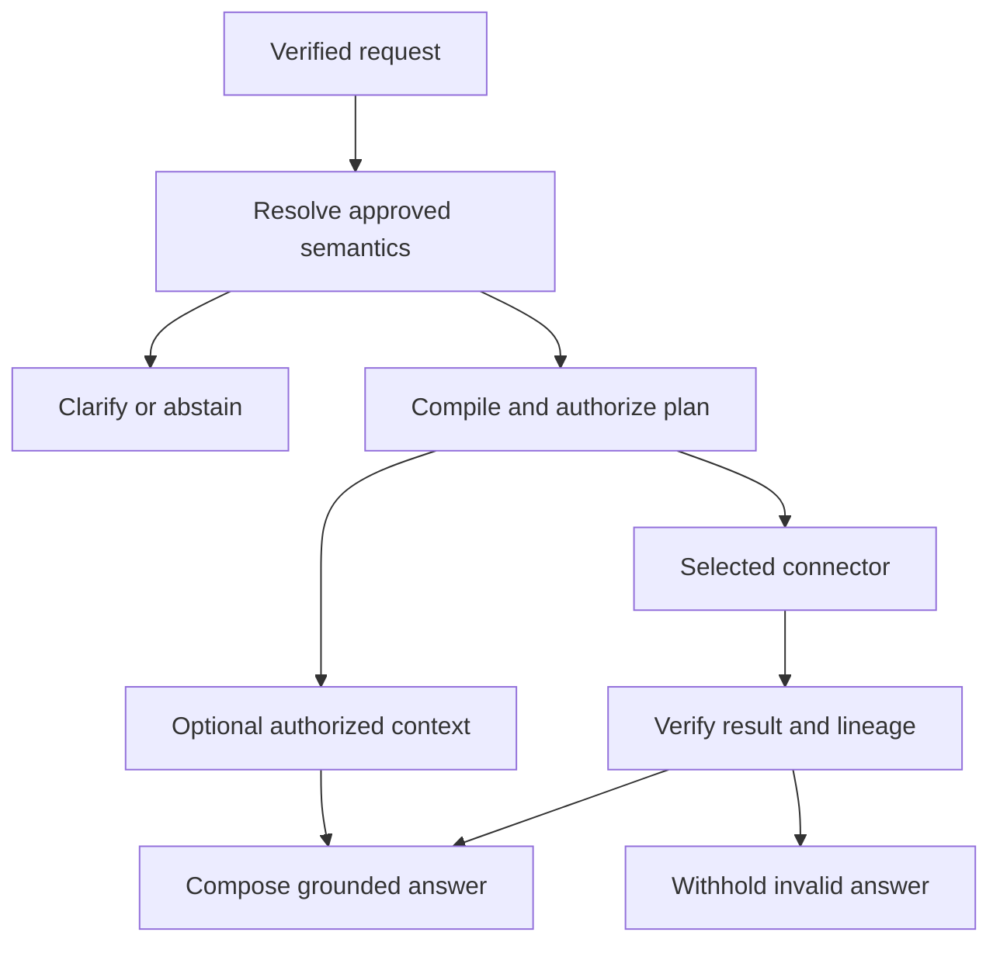

# Talk2Data: consolidated product and orchestration plan

Updated: 2026-09-07. Accepted Cycle 1 baseline: main commit
`ba198541dc14821dc497217e97cf67db20234d5c`. Accepted Cycle 2 baseline:
`67dba4f65887ed5ea8f572eb8972f98ac1797053` (PR #20). Cycle 2 implementation and private
acceptance procedure: [Internal identity and BigQuery](INTERNAL_BIGQUERY.md).

## 1. Decision and delivery boundary

Use **Talk2Data as the canonical product repository**. Build a React/TypeScript workspace
and a Python/FastAPI backend around its existing governed semantic registry, query compiler,
connector contract, policy checks, and answer receipts. Reuse those capabilities before
introducing another orchestration framework.

The target product uses Claude for bounded language interpretation and agent tasks, and
BigQuery for approved internal analytical data. CSV is an optional demonstration connection,
not a BigQuery loading mechanism, substitute warehouse, or automatic fallback.

Cycle 1 delivered the separated application composition, executable CSV demonstration and
React workspace. Cycle 2 adds a separate internal API, signed identity verification and a
governed BigQuery adapter. **Cycle 2 is complete on the user's revised placeholder boundary**;
live GCP/SSO activation and validation remain deferred release gate DG-1. CSV imports remain
an independent working data connection, never a BigQuery upload or automatic fallback.
Cycle 3 implements live definition governance and CSV reproducibility, documented in
[the governance runbook](DEFINITION_GOVERNANCE.md). Claude and durable multi-agent orchestration remain later cycles.
The current increment is not an enterprise production release.

No existing repository is archived, renamed, merged wholesale, or made private by this work.
No existing UI redesign PR is overwritten. The repository is public: only generic code and
synthetic sample data belong here. Internal definitions, schema mappings, credentials, query
examples containing company information, and production configuration require an approved
private location before integration.

## 2. Requirements and present status

| Requirement | Foundation implementation | Remaining enterprise work |
| --- | --- | --- |
| One product repository | Talk2Data owns the backend, new React workspace, tests, and this plan | Review donor modules individually; retire duplicates only after migration acceptance |
| React + Python | React/TypeScript in `apps/web`; FastAPI remains in `src/talk2data` | CopilotKit integration after the server run/event protocol is stable |
| Thin main files | `main.py` exports ASGI application; `main.tsx` mounts UI; `App.tsx` composes panels | Keep future business logic out of these entry points |
| Independent data connections | CSV has its own configuration/workspace; BigQuery now has a separate internal API, adapter, private mappings and identity binding; existing adapters retained | Execute restricted-principal GCP acceptance with approved private configuration |
| CSV upload | Bounded UTF-8 template, isolated ephemeral sessions, source hash, replace/clear/state endpoints | Governed mapping wizard for additional schemas and metric families |
| Business definitions | Metric/dimension metadata, named owners, draft/review/approval, atomic snapshots/events, effective dates, revocation and citations; CSV review UI | Business-owned production contracts and benchmark approval; governed formula/mapping migrations; search index adapter if needed |
| Question-to-answer logic | Reuses admissibility, Business Query IR, deterministic execution, result checks, and receipt-backed composition | Wider question benchmark, fiscal-calendar correctness, ratio/time-grain coverage |
| Frontend/backend synchronization | Backend source fingerprint, explicit state refresh, stale-source rejection, latest completed result | Durable runs, incremental events, reconnect/replay, idempotency, cancellation, cross-device history |
| Claude API | Target architecture only; CSV never sends a file or question to a model | Provider adapter, schema validation, model configuration, budgets, approved data-egress policy |
| Multiple agents | Responsibility and state-machine design below; not autonomous agents in this branch | Bounded orchestration, specialist tools, evaluations, permission enforcement, durable checkpoints |
| Enterprise operation | Signed identity and server-owned tenant/scope grants implemented in the private API; separate container; CSV disabled by default | Live SSO/IAM/private ingress acceptance, audit retention, load tests, SLOs and recovery |

The accepted baseline has working synthetic SQLite and PostgreSQL reference adapters.
Cycle 2 adds a BigQuery implementation with recording-port and official-SDK contract tests.
No real BigQuery connection or company schema has been verified yet.

## 3. Repository organization and dependency direction

| Location | Responsibility | Must not contain |
| --- | --- | --- |
| `apps/web/src/main.tsx` | Mount the React application | Connector credentials or business calculations |
| `apps/web/src/App.tsx` | Compose source, chat, and evidence panels | HTTP implementation, SQL, provider SDK calls |
| `apps/web/src/components` | Focused UI components | Direct warehouse access or authorization decisions |
| `apps/web/src/hooks/useWorkspace.ts` | User operations, busy/error state, state synchronization | Business metric formulas |
| `apps/web/src/lib/api.ts` | Same-origin HTTP requests and error handling | Cloud project IDs, service-account keys, Claude keys |
| `src/talk2data/main.py` | Stable ASGI import and application export | Connection construction or query logic |
| `src/talk2data/bootstrap.py` | Server dependency composition and lifecycle | SQL generation or data interpretation |
| `src/talk2data/api/routes` | Validate HTTP contracts and call services | Connection-specific execution code |
| `src/talk2data/services` | Semantic resolution, policy, orchestration, ingestion, verification | UI rendering or environment secrets embedded in logic |
| `src/talk2data/tools` | Small typed capabilities: resolve a definition, execute a bound plan | Unrestricted shell, arbitrary network access, or automatic source switching |
| `src/talk2data/connectors` | Provider-specific execution behind `DataConnector` | Browser sessions or agent prompts |
| `src/talk2data/core` | Validated runtime configuration | Real secret values in source control |
| `resources/domain_packs` | Public synthetic semantic examples | Internal company definitions |
| `tests` and `apps/web/src/**/*.test.{ts,tsx}` | Regression, contract, UI interaction, and isolation tests | Live credentials or production data fixtures |

Dependencies flow from UI to API to application services to typed tools and connector ports.
Drivers implement the ports. The UI never selects a project, table, credential, or physical
SQL object; an authenticated server-side binding makes those decisions in the internal product.

Start as a modular monolith with separately testable modules. Separate deployment processes
are justified by trust boundaries, scaling, or workload duration—not by having one service
class per file. Deploy the public demo separately from the internal product before enabling
internal data access.

## 4. Connection isolation

### CSV demonstration

The feature is opt-in through `CsvDemoSettings`, independent of `T2D_DATA_BACKEND`.
It uses the bundled public demo semantic registry even when another registry is configured
for the existing runtime. Uploads cannot replace or publish business definitions.

An opaque, server-issued bearer capability identifies each demo workspace. The caller does
not submit roles, tenant IDs, warehouse IDs, SQL, filesystem paths, or model settings.
The browser keeps this capability in session storage and sends it in `X-Demo-Session`.
This is anonymous demo isolation, **not enterprise authentication**. Anyone holding the token
has that demo session's authority. HTTPS and a trusted origin are required outside loopback.

Each accepted file produces an immutable data object with a SHA-256 fingerprint. Each
question binds a fresh connector registry containing only CSV adapters. An unavailable
metric, missing date, permission mismatch, invalid filter, or oversized result ends in an
explicit rejection or abstention. It never invokes the existing runtime registry.

Uploads and questions are not persisted to disk by the CSV workspace. One current answer and
the latest four successful runs, including their original CSV references and definition snapshots,
are retained in process memory. Sessions have a fixed lifetime, with expired entries pruned on subsequent
operations. Expiry is an access limit, not an immediate secure-erasure guarantee. Clear removes
the session's references; process shutdown removes all demo state. Single-worker use is required.

### Internal BigQuery — implemented, live acceptance pending

Cycle 2 implements `connectors/bigquery.py`, dedicated configuration and approved mapping
models, an SDK port/driver and the `internal_main.py` application composition. The detailed
contracts, restrictions and acceptance steps are in [the private runtime runbook](INTERNAL_BIGQUERY.md).
The public demo cannot initialize this connection or select it through a CSV request.

The internal adapter receives:

- An identity verified by server middleware, including tenant and authorized data scope.
- An approved logical metric plan, its semantic snapshot, and a validated physical mapping.
- An allowlisted project, dataset/view, location, billing project, and cost limit from private configuration.
- Workload-provided credentials through Application Default Credentials or approved identity
  federation; no downloaded service-account JSON in the UI or repository.

Execution policy:

1. Resolve the user's logical source binding after authorization.
2. Compile a parameterized, single read-only query from approved mappings. Never execute raw
   model-generated SQL. Validate identifiers separately from parameter values.
3. Apply tenant/row/column restrictions, including BigQuery-enforced controls where available.
4. Dry-run the query; check scanned bytes, referenced objects, and job location.
5. Apply maximum bytes billed, result-row limits, a deadline, and an idempotent job identity.
6. Execute, poll or cancel the job, and reject incomplete or truncated results.
7. Return a receipt with job ID, mapping version, semantic version, scope, source snapshot
   identity where available, result hash, execution timing, and cost information.

A dry run is a validation/cost-estimation control, not authorization. A row limit is not a
substitute for a scan-cost limit. These controls follow Google's
[query execution](https://docs.cloud.google.com/bigquery/docs/running-queries) and
[cost-control](https://docs.cloud.google.com/bigquery/docs/best-practices-costs) guidance.

### Existing adapters

Keep synthetic SQLite and PostgreSQL behind their current explicit backend configuration.
They remain available for existing demonstrations and compatibility tests. CSV selection
does not change that configuration. The existing APIs accept client-supplied access context;
that is not suitable for exposure to internal data without verified identity middleware.

## 5. CSV contract in this increment

The first template supports **Mobile Activations only**. Its approved operation is a sum of
daily successful activation counts. Arbitrary uploaded columns are not inferred into new
metrics. This keeps the calculation linked to an existing business definition.

| Column | Required | Contract |
| --- | --- | --- |
| `date` | Yes | Exact ISO `YYYY-MM-DD` day |
| `region` | Yes | NORTHEAST, SOUTHEAST, CENTRAL, or WEST |
| `channel` | Yes | RETAIL, DIGITAL, or CARE |
| `activations` | Yes | Non-negative integer, at most 1,000,000,000 per row |
| `market`, `store`, `plan` | No | Nonempty bounded identifier-like values; present columns enable those dimensions |

Validation rejects duplicate headers, unsupported headers, extra/missing cells, duplicate
date/dimension keys, malformed UTF-8/CSV, null bytes, formula-like values, non-finite or
fractional counts, and size/row-limit breaches. The default upload limit is 2 MB and 20,000 rows;
the default workspace capacity is 16 sessions with a 30-minute lifetime.

Queries require observed data for every requested day, including comparison periods. Returned
groups with missing days are rejected. Explicit zero rows represent known zero observations;
missing rows do not. More than 100 result groups is rejected instead of returning a silently
truncated answer. Current/comparison group mismatches are rejected.

These are structural and arithmetic checks. They do not prove that the file contains every
business event, region, or store that should exist. The UI and answer caveats state that
business completeness is not independently verified.

Future CSV expansion requires an approved mapping step: select a semantic metric, map source
columns, specify grain and timezone, validate aggregation/additivity, preview errors, and
approve a mapping version. Ratios need governed numerator/denominator semantics; averaging
displayed percentages is not a general solution. No schema autodetection may publish definitions.

## 6. Live business context

“Live context” means current, approved **business definitions for metrics and dimensions**.
It is different from recent source rows, chat history, or an embedding index.

The target context record includes a stable ID, definition, aliases, owner, approval status,
semantic version, effective interval, unit, aggregation, additivity, valid dimensions,
dimension meaning, join paths/cardinality, grain, timezone/calendar, inclusion/exclusion rules,
filters, classification, physical mapping reference, and known caveats.

Publication strategy:

1. A steward drafts or imports a definition in the private semantic registry.
2. Automated checks validate references, compatibility, joins, calendar rules, and benchmark queries.
3. The designated owner approves a version with an effective time.
4. Publish an immutable snapshot and an activation event.
5. Refresh search indexes and invalidate caches keyed by the changed definition versions.
6. New runs resolve the active authorized snapshot; in-flight runs remain pinned to their original snapshot.
7. Every answer cites the exact definition version/hash used, with a user-visible notice if newer semantics exist.

An embedding index can help find candidate IDs, but the semantic registry remains authoritative.
If definitions conflict, permissions are missing, or a requested effective version cannot be
resolved, ask for clarification or abstain. Do not let an agent invent a formula to fill the gap.

Cycle 3 implements this lifecycle for names, descriptions, owners and aliases of existing
metrics and dimensions. Physical calculations, source bindings, classification and semantic
calculation versions remain strict separate contracts. Formula changes require a reviewed
mapping/definition migration and regression benchmark; changing explanatory text cannot alter SQL.

The shared definition store atomically commits each immutable pack snapshot and its ordered
publication event with an optimistic revision check. Every request reads the store and builds
its compiler from a pinned copy; metric semantic hashes also include relevant dimension records.
No stale semantic object or embedding cache is used. Publication and withdrawal are visible
through state refresh and API reads; push delivery/replay belongs to Cycle 5.

The CSV UI offers an explicitly labeled single-user review exercise. The private API verifies
identity and requires distinct author/reviewer subjects with server-owned actions and complete
publication clearance. Exact definition citations accompany queries in both profiles. CSV retains
four old runs and their data for reproduction within the current session. Internal definition
history can persist to a private SQLite file; durable internal query history belongs to Cycle 5.
See [the implementation and acceptance contract](DEFINITION_GOVERNANCE.md).

## 7. Bounded multi-agent orchestration

Use one server-owned state machine. Agent outputs are proposals; deterministic services
retain authority over identity, data scope, semantic approval, query compilation, and answer release.
“Agent” need not mean a separate process or a model call for every step.

| Role | Inputs | Allowed capabilities | Output / limit |
| --- | --- | --- | --- |
| Coordinator | Verified principal, question, conversation state | Dispatch typed tasks; enforce deadline and budget | A bounded run plan; cannot grant permissions |
| Semantic resolver | Question and authorized semantic catalog | Resolve metric/dimension IDs and approved versions | Grounded interpretation or clarification |
| Query planner | Resolved semantic contract and allowed scope | Produce typed Business Query IR | No executable free-form SQL |
| Query executor | Approved IR and selected connection binding | Validate, estimate, execute, cancel | Receipt-backed data; no provider fallback |
| Context researcher | Explicit request for explanatory context | Search approved, ACL-filtered knowledge sources | Cited evidence with freshness and scope |
| Result verifier | IR, definition snapshot, source receipt, results | Deterministic bounds/lineage/completeness checks | Pass/fail and reasons |
| Answer composer | Verified results and approved cited context | Format answer, table, and caveats | No unsupported quantitative claims |

Only independent retrieval tasks may run in parallel. Query planning depends on semantic
resolution; execution depends on policy and compilation; numerical answer release depends
on verification. A second model's agreement is not proof that an answer is correct.

The initial implementation reuses deterministic admissibility, planning, query execution,
verification, and answer composition. It does not claim that Claude, Hermes, or multiple
autonomous agents ran a CSV question.

## 8. Claude integration strategy

Create a provider-neutral interpretation port and a separate Claude adapter under a provider
module. Preserve existing local interpreters as explicit options; do not route internal data
to another provider automatically after a failure.

Select an approved Claude model and endpoint through server configuration. The provider
adapter owns API authentication, timeouts, output schema validation, token limits, bounded
retries, and sanitized errors. The orchestrator owns task budgets and allowed tools.

Use Claude tool calls as typed requests for server capabilities, not direct permission to
query a warehouse. The tool runner verifies authorization and arguments before execution,
then returns a bounded result. This follows the separation described in
[Claude's tool-use documentation](https://platform.claude.com/docs/en/agents-and-tools/tool-use/overview).

Before internal activation, approve which data classes can leave the GCP boundary, whether
the deployment uses the direct Claude API or an approved hosted endpoint, and whether row
values may be included at all. Prefer sending the minimum authorized semantic context and
aggregated evidence. Treat retrieved documents, CSV contents, and user text as untrusted data.

No prompt may override policy. No API key, source credential, or raw sensitive row is included
in logs, prompts, frontend environment variables, or query receipts. Provider failure produces
an explicit unavailable/degraded state; a rules-only mode must be visibly labeled.

## 9. Frontend/backend synchronization

The backend is the source of truth for accepted datasets, source revisions, definitions,
query plans, run status, and receipts. React owns drafts, focus, selected panels, and other
presentation state.

Foundation protocol:

| Endpoint | Purpose |
| --- | --- |
| `POST /v1/demo/csv/sessions` | Create bounded ephemeral demo capability |
| `POST /v1/demo/csv/upload` | Validate raw CSV atomically, replace source, invalidate the last answer |
| `GET /v1/demo/csv/state` | Fetch selected source, approved metric definition, latest result |
| `POST /v1/demo/csv/chat` | Ask against a required source fingerprint and explicit date anchor |
| `POST /v1/demo/csv/clear` | Remove the demo session and its data references |

The frontend sends the source fingerprint with each question. A changed source produces a
409 rather than running against a different file unnoticed. Operations within a session are
serialized; repeated clicks are also guarded in the UI. Successful replacement clears old
results. Refresh restores the backend's latest complete snapshot. A receipt is shown only when
its file hash matches the selected source. Session expiry clears local state and requires an
explicit new session. There is no cross-source retry.

Enterprise protocol, to implement:

- `POST /runs` accepts a client request ID, conversation ID, question, and selected logical
  connection. The server derives principal/scope and returns a durable run ID.
- `GET /runs/{id}` returns the current snapshot; event streaming is not the only recovery path.
- SSE streams ordered, persisted events with run ID, sequence, event type, timestamp, and
  typed payload. Resume uses the last acknowledged sequence and deduplicates replays.
- Events include interpretation, clarification, tool start/end, query job state, result-ready,
  answer-ready, failure, and cancellation. Show progress events, not hidden model reasoning.
- Cancellation is best effort until a terminal state is confirmed; interrupted jobs must not
  publish later answers into a newer conversation revision.
- Idempotent submissions and a transactional outbox prevent duplicate query jobs and lost updates.
- Cache keys include tenant, principal/scope, source binding/version, semantic snapshot, plan
  hash, and source freshness. Permission or definition changes invalidate affected caches.

CopilotKit may be integrated at the UI adapter layer after these contracts are stable. It must
not become the owner of authorization, business definitions, or warehouse credentials.

## 10. GCP deployment and security design

Use separate demo and internal deployment identities, configuration, ingress policies, and
data stores. For the internal product, begin with Cloud Run for API/orchestration services,
Cloud SQL PostgreSQL for application state and semantic governance, approved object storage
for retained artifacts, and an event/job mechanism appropriate to durable execution.
Choose regional placement and connectivity with the organization's platform team.

Production gates:

- Verify identity server-side using the approved identity provider. Derive tenant/roles from
  trusted claims and entitlements; reject client-controlled access contexts at the internal edge.
- Apply authorization to definitions, conversations, search results, caches, artifacts, and
  every connector call, not only the first chat endpoint.
- Use least-privilege runtime identities, Secret Manager references, private ingress where
  required, and separate build/deploy/query responsibilities.
- Put byte limits, authentication, rate limits, and concurrency limits at the ingress boundary;
  application limits remain defense in depth.
- Add structured audit events without sensitive prompt/row bodies, trace correlation,
  query-cost telemetry, token budgets, and access-denied monitoring.
- Define artifact and conversation retention, deletion guarantees, backup policy, restore
  drills, incident response, disaster recovery, and explicit RPO/RTO with owners.
- Conduct tenant-isolation, injection, dependency, data-egress, and permission-revocation testing.

The runtime image now bundles the React assets. Its existing main-branch workflow publishes
an updated `edge` image after merge; CSV remains opt-in. The standalone demo configuration
binds to loopback and does not enable CSV in an existing public deployment or connect GCP.
The anonymous demonstration must not be advertised as production-safe.

## 11. Consolidation and reuse rules

The reusable foundation is already in Talk2Data: Domain Packs, policy engine, semantic resolver,
IR/compiler, connector interface, deterministic answer checks, receipts, and the test suite.
The new UI is intentionally a small consumer of that backend, not a second backend.

For each candidate module in another repository, record:

1. Repository, immutable source commit, file paths, owner, and license/provenance approval.
2. The target product capability and why the current Talk2Data module does not already cover it.
3. Dependencies, runtime assumptions, security boundaries, and test coverage.
4. Whether to reuse directly, adapt behind a port, reproduce behavior, or decline the import.
5. Acceptance tests, migration owner, rollback method, and retirement criteria for the duplicate.

Do not merge whole repositories just because they each contain “agents,” “context,” or “chat.”
Avoid importing local developer-agent tools, shell execution, unrestricted MCP servers, or
another product's authentication assumptions into the analytical runtime.

No donor-repository code was copied in this increment. Existing UI branches remain candidates
for a follow-up comparison, not silently accepted dependencies. This plan supersedes a
new-repository recommendation for product code; private configuration still needs its own
approved storage boundary while the canonical repository is public.

## 12. Ordered delivery milestones and acceptance gates

| Milestone | Work | Acceptance gate | Dependencies |
| --- | --- | --- | --- |
| 1. Modular demo foundation | Thin entry points, typed tools, isolated CSV session/import/query path, React panels, source synchronization, packaged demo, this plan | Existing tests stay green; CSV answers reproduce uploaded counts; wrong scope/source, missing dates, invalid files, and truncation are rejected; installed React/Python demo passes HTTP acceptance | PR #18 is the delivery record; its accepted commit is the baseline for cycle 2 |
| 2. Internal identity and BigQuery — complete with placeholders | Separate identity/BigQuery implementation, private configuration templates, dry runs, budgets, cancellation and receipts | User accepts tested implementation and unconfigured connection placeholders; optional CSV works independently. Live cloud acceptance moves to DG-1 | Real GCP/SSO configuration required only before internal activation and final release |
| 3. Live semantic governance — complete in PR #21 | Metric/dimension metadata, draft/review/approve lifecycle, effective snapshots, atomic publication events, fresh request resolution, definition UI | New queries use active publications; CSV historical runs reproduce with pinned data/definitions; conflicts and revocation fail closed; 96% quality gates and packaged acceptance | Synthetic CSV proves mechanics; business owners approve production contracts before activation |
| 4. Claude and bounded orchestration | Provider adapter, specialist task contracts, typed tools, execution budgets, injection controls | Model cannot expand access or execute arbitrary SQL; benchmark correctness and abstention thresholds pass | Approved model/endpoint and data-egress policy |
| 5. Durable collaboration and sync | Conversation persistence, run/event store, SSE replay, idempotent jobs, cancellation, artifacts, optional CopilotKit adapter | Refresh/reconnect/retry cannot duplicate jobs or mix results across tenant/source/version; terminal states survive restart | Internal application database and job platform |
| 6. Enterprise release | IaC, CI/CD promotion, observability, retention, security review, load/cost testing, recovery, operations runbooks | Named security/data/platform/product owners sign off; SLO, RPO/RTO, and budget tests pass | Milestones 2–5 complete |

These six milestones are the six delivery cycles. Execute one milestone at a time and close
its current accepted gate before starting the next. The user explicitly revised Cycle 2 to
accept connection placeholders and defer real cloud validation; this authorizes Cycle 3 using
CSV imports. They are a scope plan, not a promise of six
fixed-duration sessions: access to GCP, identity, business owners and the approved Claude
endpoint determines when the dependent gates can actually pass. A completed UI is not
evidence that backend permissions or metric correctness are ready.

### Cycle 1 delivery contract

The goal is a reproducible modular demonstration that provides the starting point for the
enterprise integrations. Its fixed scope covers R1, R2 and the foundation portions of R7–R9.

| Acceptance item | Required evidence |
| --- | --- |
| One runnable UI/API package | Multi-stage `Dockerfile`; standalone `docker-compose.csv-demo.yml`; packaged asset retrieval |
| Reproducible CSV answers | `scripts/csv_workspace_smoke.py`: 736 synthetic rows, July total 24,676, exact region totals and verified receipts |
| Definition/source synchronization | Definition version and source fingerprint match the answer; restore and replace behavior pass |
| Isolated optional data source | Independent CSV registry/configuration; empty second session; rejected connector injection; CSV disabled by default |
| Failure behavior | Invalid upload preserves state; stale source returns 409; missing dates abstain; cleared session returns 401 |
| Existing behavior and quality | Python/React coverage gates, typing/build checks, real PostgreSQL and Ollama regressions, container build and CodeQL |
| Delivery handoff | PR #18 records measured validation and the accepted commit; README/runbook provide startup, verification and shutdown |

The `CSV demo release acceptance` workflow builds and starts the actual container before
running the HTTP acceptance script. This complements React interaction tests; browser,
accessibility, GCP and Claude acceptance remain later explicit gates. Once these foundation
checks pass and PR #18 is merged, cycle 1 is complete. Stop there before starting cycle 2.

## 13. Verification and benchmark strategy

The first benchmark uses uploaded synthetic daily counts with known exact sums. Extend it to
approved enterprise questions with expected metric IDs, dimensions, time ranges, access
scope, SQL/IR constraints, numeric results, and required abstentions.

Maintain separate suites:

- Pure contract tests: parsing, semantic resolution, plan hashing, scope validation, arithmetic.
- Connector tests with test doubles: cost caps, job timeouts, cancellation, partial results,
  mapping errors, region mismatch, and provider failures.
- Internal integration tests: approved isolated GCP test datasets and restricted identities;
  never assume unit mocks prove cloud authorization.
- Provider evaluation: grounded metric selection, ambiguity, conflicting definitions,
  unsupported questions, malicious retrieved text, and numeric hallucination prevention.
- Frontend protocol tests: stale-source rejection, error/expiry handling, no automatic
  fallback, receipt/source matching, and date anchoring.
- End-to-end browser acceptance and accessibility review before release. Not performed in
  this foundation implementation session.

### Mandatory quality gates

- Python: measure every module in `src/talk2data`, including PostgreSQL and the memory/evidence
  contracts. Enable branch measurement. Require **96% lines and 96% branches independently**;
  retain the combined 96% pytest gate as well. `scripts/check_coverage.py` rejects missing
  branch measurement or an empty report. Do not remove production modules to raise the score.
- React: Vitest/V8 measures every `.ts` and `.tsx` application file, including components,
  hooks, and `main.tsx`. Require **96% lines, statements, functions, and branches** independently.
  Only test code is excluded. The in-memory React interaction tests are not browser or visual QA.
- CI: lint, format, strict Python typing, Python 3.11/3.12/3.13 matrix, locked Node dependencies,
  TypeScript compilation, React tests, production build, and high-severity dependency audit.
  Validate YAML syntax and top-level trigger/job structure for every workflow, including
  workflows restricted to old branches; GitHub can reject malformed files after a main merge.
  Store Python and React coverage reports as CI artifacts tied to the tested commit.
- Real service gates: retain PostgreSQL integration and Docker/Ollama smoke workflows. The
  smoke test must check requested metric, exact dimensions, row count, verification, and real
  provider use. A model returning a catalog-wide grouping must fail acceptance even if SQL ran.
- A failing correctness, permission, or isolation test blocks delivery regardless of coverage.
  Record any skipped integration tests and the environment needed to execute them. Do not
  count a mocked cloud call as proof of BigQuery IAM or a provider evaluation.

Coverage configuration follows the [Coverage.py configuration reference](https://coverage.readthedocs.io/en/latest/config.html)
and [Vitest coverage configuration](https://vitest.dev/config/coverage). Exact measured results,
test counts, and CI outcomes belong in the PR attached to the tested commit.

### Requirements traceability and release acceptance

This table is the acceptance ledger for the original product. A working foundation may be
reviewed as an increment; **the finalized enterprise product requires every row to pass**.
Future changes must identify one of these requirement IDs and its acceptance evidence. Work
that does not support an agreed row belongs in a separate proposal, not this release scope.

| ID | Original requirement | Current executable evidence | Enterprise completion criterion |
| --- | --- | --- | --- |
| R1 | One Talk2Data repository; small tools and services; thin UI/main | Connector factory, definition/query tools, separate route/service/connector modules; import and build checks | New capabilities preserve these boundaries; one reviewed release commit and deployment profile |
| R2 | Optional CSV data connection, independent of BigQuery | `test_csv_demo.py`: exact totals, source isolation, invalid input, gaps, capacity, expiry, stale fingerprints, replace/clear; React upload and evidence flows | Demo acceptance passes in its own deployment; internal credentials and data cannot enter the demo process |
| R3 | Claude API | Provider contract tests protect the existing local-model boundary; **Claude adapter not implemented** | Configured Claude adapter passes schema, timeout, rate-limit, budget, prompt-injection, grounded-selection, and real-provider benchmark gates |
| R4 | GCP BigQuery remains an internal separate connection | Separate internal API/adapter/configuration; signed-token, scope/classification, SQL, SDK budget/cancellation/receipt tests; opt-in live benchmark | Live read-only queries, approved views, byte caps, location, cancellation and IAM pass with restricted GCP principals; pending private environment |
| R5 | Live context means business definitions of each metric and dimension | `test_definition_governance.py`, `test_definition_workflows.py`, React definition flows and HTTP smoke: lifecycle, owners, effective dates, immutable citations, atomic publication, fresh resolution, conflicts/revocation and CSV historical reproduction | Production business-owner approval and benchmark; durable internal run reproduction integrated with Cycle 5; formula/mapping changes use coordinated migrations |
| R6 | Multiple agents working together | Interpretation, compiler, execution, and verification modules have separate tests; **durable agent orchestration not implemented** | Bounded specialist agents use typed tools; budgets and terminal states persist; cannot expand permission or change the selected source; causal claims require evidence |
| R7 | Frontend/backend data sync and context | React flow/API tests: restore, upload, source-bound ask, refresh, expiry, error recovery, clear, old-answer removal; backend stale-source rejection | Durable conversations and semantic/source versions; event replay, reconnect, idempotency, cancellation, restart recovery and cross-session isolation pass |
| R8 | Validated answers aligned to business meaning | Known-sum CSV checks; interpreter grounding regression; complete-period coverage; receipt lineage/hash/row count; bounds, duplicate keys and comparison arithmetic tests | Business-owned question benchmark passes agreed correctness/abstention thresholds across initial metric scope, fiscal calendars, joins, ratios, dimensions and access scopes |
| R9 | Enterprise product quality, more than 95% coverage | Independent 96% Python line/branch and React line/branch/function/statement gates; retained real PostgreSQL and Ollama jobs | SSO, trusted tenant identity, private ingress, secrets, audit/retention, load/cost/SLO and recovery gates pass; browser accessibility acceptance and release approval recorded |

### Completion and stopping rules

1. Each increment includes code, meaningful regression tests, this ledger's status updates,
   and measured validation tied to the exact PR commit. A plan-only item stays incomplete.
2. Keep CSV as an optional source and keep BigQuery internal throughout all increments.
   No fallback or shared upload path may silently cross that boundary.
3. Do not claim production readiness from UI completeness, coverage, or mock tests alone.
   The final release requires the real Claude/GCP, identity, semantic publication, durable
   orchestration, sync/recovery, performance, and browser acceptance gates above.
4. Once the current increment passes its required gates, stop optional test expansion and
   advance the next agreed product milestone. Review and deployment use the same tested commit.

## 14. Private environment decisions required for acceptance

1. Which GCP project, BigQuery location, billing project, and approved datasets/views?
2. Which identity provider and tenant model, and who owns entitlement mapping?
3. Where should internal semantic definitions and physical mappings live while this repo is public?
4. Which 10–20 metrics and dimensions are the first governed scope, with named business owners?
5. Direct Claude API or an approved hosted endpoint, and which data classes may be sent?
6. Who approves production ingress, retention, audit policy, and deployment promotion?

No production credentials should be posted into an issue, chat, CSV, or source file. Configure
them through the approved secret and workload-identity workflow when the integration is authorized.

## 15. Next implementation boundary

Cycle 1 is accepted through PRs #18 and #19. Cycle 2 is accepted through PR #20 on the user's
revised placeholder boundary. Cycle 3 is delivered through [PR #21](https://github.com/yashumani/talk2data-conversational-intelligence/pull/21): versioned metric/dimension definition metadata,
approval, publication and reproducibility using the separate CSV data connection. Its PR must
record exact source checks, measured coverage and packaged acceptance before closure. The next
cycle is Cycle 4: the Claude adapter and bounded specialist orchestration; do not start it in
this increment.

### Deferred release gate DG-1 — real GCP and SSO

Status: **deferred, not validated**. Activation requires the approved billing project/location,
views and dependency allowlist, IdP/issuer/audience, workload principal and private configuration
location. Before enabling internal BigQuery or completing the enterprise release, run the
restricted-principal benchmark, verify real scoped results, private ingress/IAM and controlled
cancellation/timeouts. Placeholders must not report a connected or healthy warehouse. The
user-approved deferral changes delivery sequencing, not the evidence required for cloud readiness.

The [CSV workspace runbook](CSV_WORKSPACE.md) remains the independent demo acceptance procedure;
[INTERNAL_BIGQUERY.md](INTERNAL_BIGQUERY.md) owns the private API activation procedure.
