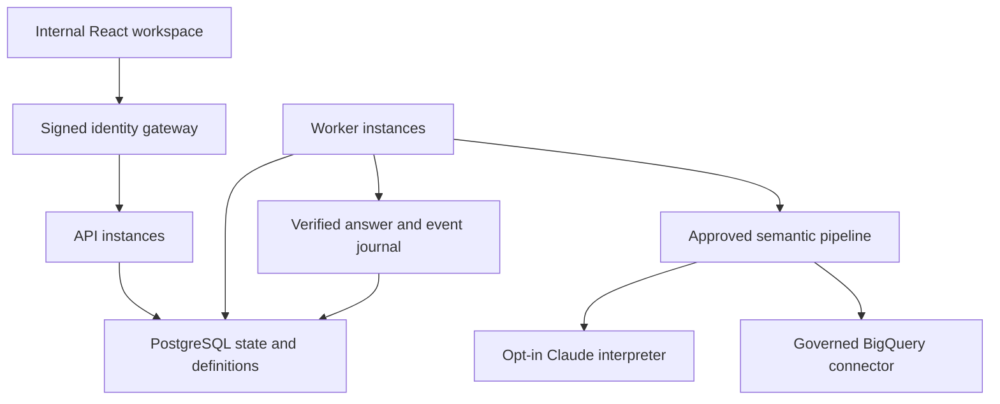

# Shared internal runtime: Cycle 6.2

Updated 2026-09-08. The internal application now has an explicit PostgreSQL state adapter,
independent API and worker processes, and a separately built React workspace. The CSV demo
continues using its own SQLite store and capability sessions. Neither profile can select the
other profile's connection through a chat request.

## Components and deployment

| Component | Responsibility |
| --- | --- |
| `core/state_config.py` | Private DSN secret reference, queue/global/tenant limits, lease and heartbeat intervals |
| `services/postgres_database.py` | Bounded transactions, verified transport, explicit migration and schema checks |
| `services/postgres_runs.py` | Atomic admission, conversation revisions, request deduplication, ordered events, cancellation and fenced completion |
| `services/postgres_governance.py` | Shared definition publications, optimistic review revisions, current authorization grants and grant audit |
| `services/distributed_runs.py` | Queue admission and independently running bounded workers |
| `internal/worker.py` | Reuse of the existing semantic resolver, compiler, connector, verifier and composer |
| `apps/web/src/internal` | Signed internal conversations, current definitions, progress, cancellation and saved evidence |
| `operations/shared_state.py` | Operator-only migration, schema check and compare-and-swap grant publication |
| `infra/gcp` | Private Cloud Run API/worker services and regional Cloud SQL reference configuration |



The analytical BigQuery connection and the PostgreSQL application-state connection have
different configuration models, secret references, services and responsibilities. PostgreSQL
stores retained questions, results, business definitions and authority snapshots. CSV data is
never ingested into either internal connection by this runtime.

## Transaction and execution logic

Admission locks the shared admission row and conversation. It compares the full canonical
request hash before checking a new revision, so two API instances acknowledging the same
submission return the same run. Changed question/date/definition/revision content under an
existing request ID is rejected. A database uniqueness constraint also enforces one active run
per conversation. Conversation revision, queued record and first replay event commit together.

Workers claim eligible rows using PostgreSQL row locks and `SKIP LOCKED`. The shared admission
lock serializes the short capacity decision; model/cloud calls run outside database transactions.
Global and per-tenant active limits include cancellation-pending work. Full-tenant capacity does
not block another eligible tenant. The per-process query limit is an additional bound.

A claim receives a random fencing token and a database-timed lease. Every progress, heartbeat
and terminal write checks that token, lease and current status. Another instance can persist
cancellation immediately. The owner observes it through heartbeats, cancels its operation and
withholds the answer. A late successful response cannot override cancellation or an expired lease.

Unclaimed queued work survives an API restart and can be claimed while its authority remains
valid: the journal proves it has not been dispatched. Expired claimed work becomes `INTERRUPTED`
and is never automatically requeued. This deliberately avoids promising exactly-once remote
execution or zero charges after cancellation. A new request after an uncertain interruption
requires an explicit user action.

Each deployment supplies a reviewed 40-character `deployment_revision`. Source/identity/language
configuration and that revision participate in the execution binding. An old worker cannot
claim a differently bound revision's queue. Drain the retiring revision before private rollout;
queued old work otherwise expires and uncertain claimed work is interrupted. No automatic data
or schema downgrade is performed on rollback.

## Authorization and live business definitions

The API cryptographically verifies the signed identity before creating an `ExecutionGrant`.
The grant contains the approved access snapshot and the original token expiry, never a bearer
token, provider key or warehouse credential. It is an internal database record, not a client
request field. Its tenant/subject/scope must agree with the owned conversation.

Workers read current authorization from PostgreSQL before dispatch, during monitoring and
before answer release. Current grants must equal the original scope. The original token expiry,
source binding and pinned definition must remain valid. Authorization changes therefore reach
all instances without waiting for a local entitlement file refresh. Saved-result and SSE reads
still independently reverify the caller's signed identity and live grants.

Definition state, publications and ordered governance events use the same shared database.
Optimistic revisions prevent one steward overwriting another's review. Every request resolves
the current approved publication; an admitted run keeps its pinned publication and stops if it
is withdrawn. Changing descriptive text does not authorize an unreviewed calculation or mapping.

## Explicit setup procedure

1. Create the private database, runtime database identities and approved secret mounts. The
   runtime principal needs the necessary application-table DML and read access to current grants;
   keep schema migration and grant publication with a separate operator principal. Do not grant
   application users direct database access. Restrict database/backup logs as retained private data.
2. Fill the separate API and worker runtime templates. Pin the same source, identity, Claude,
   state limits and deployment revision. Set `process_role` to `api` or `worker` respectively.
   Use a secret environment reference such as `env://T2D_STATE_DSN`; no DSN value belongs in Git.
3. Use verified TLS (`sslmode=verify-full`, approved server CA) or the authenticated Cloud SQL
   proxy Unix socket. Insecure transport is accepted only for explicitly enabled loopback tests.
4. With the operator connection, apply the explicit migration and publish initial grants:

```bash
python -m talk2data.operations.shared_state migrate --config /private/runtime-api.json
python -m talk2data.operations.shared_state publish-grants \
  --config /private/runtime-api.json --expected-revision 0
python -m talk2data.operations.shared_state check --config /private/runtime-api.json
```

Subsequent grant changes require their current revision. Changes and a content-free digest audit
commit together. Startup never replaces existing grants from the bootstrap file. Database/schema
errors fail closed and never select local SQLite or a demonstration connection as a fallback.

5. Start the API and worker using their own `T2D_INTERNAL_CONFIG_FILE` values and the same internal
   image. Cloud workers need continuously allocated CPU and at least one instance while queues
   must be processed. The API uses `/v1/internal/runs`; the old synchronous chat endpoint is
   rejected in the shared profile so it cannot bypass durable admission.
6. Enable the internal UI only with signed IAP and `web_directory=/app/internal-web`. Its address
   is `/workspace/`. The container contains a separate internal build; the entry point contains
   no connection construction. The browser uses same-origin requests, never stores bearer tokens
   and adds the required custom header to mutations. Cross-origin CORS access is not enabled.

The UI restores server-owned conversation history across devices. Pending submission data is
saved in browser session storage before POST to recover an acknowledgement lost on reload; it
is scoped to the signed identity, access hash and connection binding. This includes question
text and needs the organization's browser retention policy. Access loss clears visible results
and pending state. Reconnecting reads the existing run; it does not create a new query.

## Cloud deployment boundary

Terraform defines regional PostgreSQL, private-only addressing, managed backups/PITR, deletion
protection, separate runtime identities, pinned secret versions, private ingress, signed IAP,
bounded scaling, health probes and an authenticated Cloud SQL proxy sidecar using private IP.
API and worker image references and the proxy image must be immutable digests. There is no
`allUsers` invoker grant. Terraform validation runs without a backend or GCP credentials.

Activation still needs the organization's existing network/subnet, approved private state
backend, enabled project APIs, IAP identities/audience, secret versions, database users and
restricted BigQuery permissions. All-traffic VPC egress requires the approved NAT/egress policy
for JWKS and Claude. Configure private reachability for the browser/IAP path. The API validates
approved BigQuery view metadata at startup; its principal needs the corresponding restricted
metadata access. Workers additionally need the approved query/job/data grants. These cannot be
inferred safely from placeholder project names.

Cloud SQL backup configuration is not a tested production recovery guarantee. Restore into a
separate quarantined instance; verify state, current grants and definition withdrawals before
opening private traffic. Set and demonstrate actual RPO/RTO and retention/hold policies with
the platform owner. The Cycle 6.1 SQLite backup/retention CLIs remain specific to that profile.
This increment does not silently migrate or destroy an existing SQLite database. Decide which
reference conversations require an approved migration or archive before activating the new store.

## Verification and remaining acceptance

The CI matrix uses actual PostgreSQL, including concurrent connections, independent claiming
processes, transactional rollback, replay, tenant capacity, expired ownership, cross-instance
cancellation, shared governance and signed API-to-worker execution. Internal UI tests cover
lost acknowledgement, reconnect, cancellation, access loss and saved evidence. Both UI builds
and the real internal container are validated. These are automated acceptance records, not
browser/accessibility QA, live GCP/Claude validation or a production load benchmark.

The final stopping point and remaining environment-owned gates are in
[PROJECT_COMPLETION.md](PROJECT_COMPLETION.md).

Implementation references: PostgreSQL [locking and SKIP LOCKED](https://www.postgresql.org/docs/current/sql-select.html#SQL-FOR-UPDATE-SHARE),
Psycopg [transaction boundaries](https://www.psycopg.org/psycopg3/docs/basic/transactions.html),
Cloud Run [continuous CPU allocation](https://docs.cloud.google.com/run/docs/configuring/billing-settings),
and Google's [signed IAP integration](https://docs.cloud.google.com/run/docs/securing/identity-aware-proxy-cloud-run).
